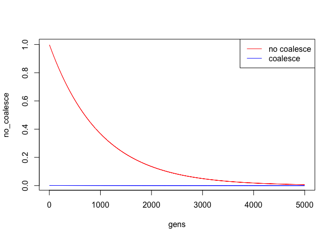
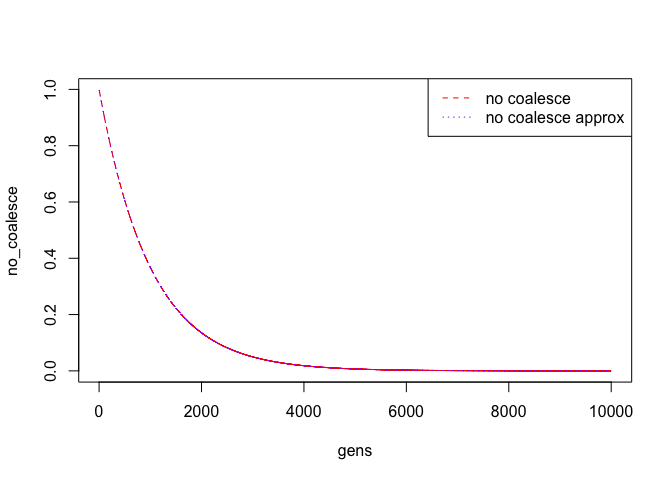

# BIO4E03_CoalescentWaitingTimesTutorial
Ian Dworkin  
February 7, 2017  


## Introduction

Today in class we are going to start exploring some properties of the *coalescent*, and in particular trying to get a sense of what waiting times for 2 alleles to coalesce are.

You will notice that in lecture Dr. Golding talked about a *sample of genes*, as opposed to a *population of alleles*. The reason for this is is we describe all of the DNA sequences that we are analyzing as genes in this context, and we are asking how they are related to one another, and how long (in terms of generations for discrete time models) until two (or more) genes have a common ancestral gene. We call this the time to most recent common ancestor (TMRCA) for those genes. Essentially the use of the term *gene* in this context (which I admit I don't like as I think it can be confusing to many students) is really equivalent to thinking about the problem of *alleles* but from the perspective of identity-by-descent (as opposed to state... i.e. whether both alleles are identical). As we discussed in class these two are not the same thing.

## A simple coalescent simulator.
Before we play with `R` too much, we are going to use another program to simulate the simplest process we can. We are using a piece of `java` software that was developed by the authors of the book *gene genealogies, variation and evolution: A primer in coalescent theory* (Hein et al. 2005) which is a primer of sorts for coalescent methods in population genetics. The e-book can be accessed through the McMaster library [here](http://books1.scholarsportal.info/viewdoc.html?id=/ebooks/ebooks0/oxford/2011-06-22/1/75898). I find chapter 4 particularly helpful.

In any case they have developed several simple pieces of teaching software. The webpage can be found [here](http://www.coalescent.dk/). We are going to use the Wright-Fisher animator, which can be [downloaded](http://cs.au.dk/~compbio/coalescent/Felsenstein.jar). It does require a working version of java, which most computers have. They have also (it is so nice!) developed a set of exercises which are perfect for the class so please open [this](http://cs.au.dk/~compbio/coalescent/wf_man.html) page.


## Examining waiting times.
As Dr. Golding demonstrated in lecture, we can start with a sample of homologous (in fact orthologous) DNA sequences, which we will call *genes*, although they truly represent alleles (or haplotypes) in this sample. If we have 2N genes in this sample (from current or *extant* individuals) we can ask the question if we randomly selected two gene from this sample what is the probability that they had a common ancestor one generation ago (i.e. the two current genes are both descendents from a common parent). 

Starting with one of the two genes (which has some particular ancestor), we can ask what is the probability that this second allele *also* has the same ancestor? Well since we have 2N genes in our sample of DNA sequences (and assuming completely random offspring production like we talked about last week) then the probability of having a common ancestor in the previous generation is just $\dfrac{1}{2N}$.  What is the probability of not having a common ancestor in the previous generation? Well it then needs to be $1 - \dfrac{1}{2N}$. See Dr. Golding's lecture notes for a few more comments on this.

We can take this back further in time now. For two genes chosen from within/between (why potentially within?), they will coalesce to a single common ancestor according to:

:Generation:| :Prob. coalesce in generation *t* : | :Prob. don't coalesce:

 ----------  ------------------------------------- -----------------------
:1:          | :$\dfrac{1}{2N}$  :                    | : $1 - \dfrac{1}{2N}$:

:2:         | :$\dfrac{1}{2N}(1 - \dfrac{1}{2N})$ :    |: $(1 - \dfrac{1}{2N})^{2}$:

:3:        | :$\dfrac{1}{2N}(1 - \dfrac{1}{2N})^{2}$: | :$(1 - \dfrac{1}{2N})^{3}$:

:t:          |:$\dfrac{1}{2N}(1 - \dfrac{1}{2N})^{t-1}$:| :$(1 - \dfrac{1}{2N})^{t}$:


So for two genes chosen at random from the sample (within/between individuals) they will coalesce to a single common ancestor in generation $t + 1$ with probability $\dfrac{1}{2N}(1 - \dfrac{1}{2N})^{t}$.

Let's explore this a bit. 

```r
coalesce_2Genes <- function(N = 500, t = 5000) {
gens <- seq(2, t)
coalesce <-  (1/(2*N))*((1 - (1/(2*N)))^(gens - 1))
no_coalesce <- ((1 - (1/(2*N)))^(gens))
plot(no_coalesce ~ gens, type = "l", col = "red")
lines(coalesce, col = "blue")
legend(x = "topright", lty = 1, 
       col = c("red", "blue"),
       legend = c("no coalesce", "coalesce"))
}
```

we can run this and see how it works.

```r
coalesce_2Genes(N = 500, t = 5000)
```

<!-- -->

Try this yourself for different numbers of samples (N) and generation times. In particular how is probability of coalescing related to sample size? time (in generations)?


# Some approximations
As shown in your lecture slides, when $2N$ gets large, then we can approximate the coalescence of two sequences to a single common ancestor in generation $t + 1$ with
$ \dfrac{1}{2N} e^{-t/2N}$. The probability of no coalescence is then just $e^{-t/2N}$. Let's try this out by modifying our function.


```r
coalesce_2GenesApprox <- function(N = 500, t = 5000) {
gens <- seq(2, t)
no_coalesce <- ((1 - (1/(2*N)))^(gens))
no_coalesce_approx <- exp(-gens/(2*N) )
plot(no_coalesce ~ gens, type = "l", col = "red", lty = 2)
lines(no_coalesce_approx, col = "purple", lty = 3)
legend(x = "topright", lty = c(2,3), 
       col = c("red", "purple"),
       legend = c("no coalesce", "no coalesce approx"))
}
```

How well does this work for different sample sizes?

```r
coalesce_2GenesApprox(N = 500, t = 10000)
```

<!-- -->

Try a variety of sample sizes (N) for the number of sequences.

## Waiting times

NEXT WEEK!!!


## Want to know more
Coalescent theory and methods are the backbone of all of modern molecular population genetics, where we use a sample of extant sequences to infer some of the evolutionary history of a sample of genes. As such there are many many aspects to the analysis of such data, much of it based on comparing observed data to simulated data generated under different evolutionary models. 
The wikipedia page has a partial list of software tools that can be found [here](https://en.wikipedia.org/wiki/Coalescent_theory#Software). The most famous of these is a little command line tool called `ms` developed by Dick Hudson over 25 years ago, which has been further developed by him and others. Many of the other tools expand and refine these approaches, that are beyond the scope of the tutorial. There are also many population genetic (and genomic) tools in `R`. A partial list can be found [here](https://cran.r-project.org/web/views/Genetics.html), [here](http://popgen.nescent.org/PACKAGES.html) and [here](https://cran.r-project.org/web/views/Phylogenetics.html). See also libraries like `coalescentMCMC`, `P2C2M`, `phyclust`, `pcrcoal`, [`scrm`](https://scrm.github.io/), `Coala`
