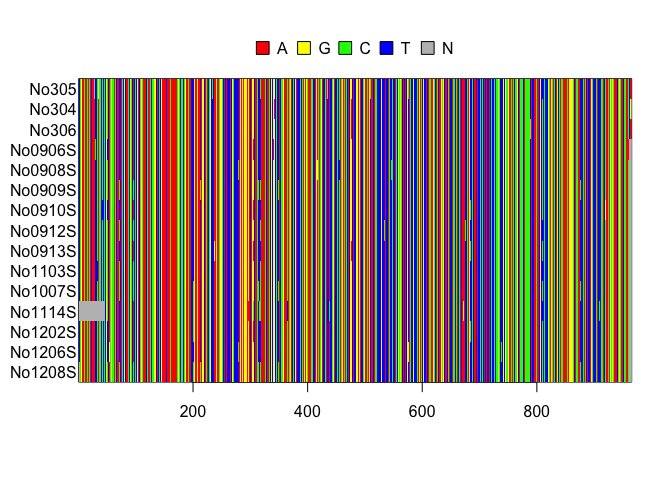

# Population Genetic Analysis using PEGAS
Ian Dworkin  
March 21, 2017  


You will need to install a new library, PEGAS (Population and Evolutionary Genetic Analysis System). Make sure to allow it to install dependencies as well.

**REMEMBER TO UNCOMMENT THE LINE BELOW**. You only need to install it once!

```r
#install.packages("pegas")
```

Then we need to load this package so R can use it. This should also load in a few additional libraries (like ape)

```r
library(pegas)
```

```
## Loading required package: ape
```

```
## Warning: package 'ape' was built under R version 3.3.2
```

```
## Loading required package: adegenet
```

```
## Loading required package: ade4
```

```
## Warning: package 'ade4' was built under R version 3.3.2
```

```
## 
##    /// adegenet 2.0.1 is loaded ////////////
## 
##    > overview: '?adegenet'
##    > tutorials/doc/questions: 'adegenetWeb()' 
##    > bug reports/feature requests: adegenetIssues()
```

```
## 
## Attaching package: 'pegas'
```

```
## The following object is masked from 'package:ade4':
## 
##     amova
```

```
## The following object is masked from 'package:ape':
## 
##     mst
```

Let's load in some data

```r
data(woodmouse)
```

This is a set of 15 sequences of ~ 1KB (so pretty short). They are from the cytochrome b gene of the woodmouse.
To see more information type `?woodmouse`

We can take a look at a summary of the data


```r
print(woodmouse)
```

```
## 15 DNA sequences in binary format stored in a matrix.
## 
## All sequences of same length: 965 
## 
## Labels: No305 No304 No306 No0906S No0908S No0909S ...
## 
## Base composition:
##     a     c     g     t 
## 0.307 0.261 0.126 0.306
```

```r
str(woodmouse)
```

```
##  'DNAbin' raw [1:15, 1:965] n a a a ...
##  - attr(*, "dimnames")=List of 2
##   ..$ : chr [1:15] "No305" "No304" "No306" "No0906S" ...
##   ..$ : NULL
```

Since R does not have a super nice graphical interface for such things, it is sometimes hard to look directly at the sequences. You can get a sense like this (using the alview function). In this case we are looking at the first 25 bp of sequence for all samples.


```r
alview(woodmouse[1:5, 1:25])
```

```
##                                25
## No305   NTTCGAAAAACACACCCACTACTAA
## No304   A........................
## No306   A........................
## No0906S A........................
## No0908S A........................
```

The first sequence shows the actual DNA sequence for one of the DNA sequences in the sample. Each row represents a different DNA sequence from that sample. The dot "." represents a short hand to say that the nucleotide is identical (by state) at that site in comparison to the first sequence. If you see a letter it means that that site is polymorphic.

We can make a few simple figures to look at the DNA alignments. These functions work on a special class of object for DNA alignments called `DNAbin`


```r
image(woodmouse)
```

<!-- -->

While you can spot the polymorphism it is not the clearest picture.

We can also look at specific bases. In this case, let's look for "n" (where we do not know the base). This gives us a sense of missing data.


```r
image(woodmouse, "n", "blue")
```

<!-- -->

Let's just look at two sequences over a short stretch of the DNA (100 bp).


```r
image(woodmouse[1:2, 1:100])
grid(100, 2, col = "black")
```

<!-- -->

1. Play around with this to try and locate some of the polymorphic regions in the sequence.


## Site frequency spectrum.

One of the things we want to be able to do is look at the SFS (Site Frequency Spectrum). This is such a common thing to do, that there is a function in `pegas` to accomplish this.


```r
(sp <- site.spectrum(woodmouse))
```

```
## Warning in site.spectrum(woodmouse): 2 sites with more than two states were
## ignored
```

```
## [1] 33  6  7  4  3  0  1
## attr(,"class")
## [1] "spectrum"
## attr(,"folded")
## [1] TRUE
```

While the SFS is pretty simple in this case, it is still easier to plot it.


```r
plot(sp)
```

<!-- -->

How does this compare to what we would might expect under complete neutrality? Before we can address that (which is best to do using simulations which we will tackle next week I hope) we need to estimate theta for the sample of DNA sequences.

You will note it says "folded" SFS. This was briefly mentioned in class. It turns out that if we know the ancestral state (i.e. which allele is the "new" mutation) we can do a lot more with the SFS. That is called the unfolded SFS. However, if we don't know which variant is ancestral and which is derived we can not *polarize* the polymorphism. In such cases we instead ask about the counts of the *minor* allele (the less frequent variant) at each polymorphic site in the DNA sequences that form the sample we are examining. 

2. Examine how the SFS changes as you use subsets of the data (at least 6 sequences please). Also feel free to look at subsets along the length of the sequence. How much does the picture change as you look at subsets of the data?

## Haplotype networks. 

We can also examine the relative "genetic distances" among the different sequences by how similar the haplotypes are.


```r
h <- haplotype(woodmouse)
net <- haploNet(h)
plot(net)
```

<!-- -->


## Measures of theta

We can now proceed and examine patterns of nucleotide diversity, Segregating sites and how they compare for this set of DNA sequences.

3. Remind yourself about nucleotide diversity (pi)


```r
nuc.div(woodmouse, pairwise.deletion = TRUE)
```

```
## [1] 0.0132
```

We can go ahead and calculate the number of segregating sites as well. The function below shows each site that is segregating.


```r
seg.sites(woodmouse)
```

```
##  [1]  30  33  35  36  42  51  54  60  72  96 106 123 201 213 234 237 279
## [18] 291 297 306 314 316 318 340 342 343 349 365 409 417 438 456 462 477
## [35] 510 514 534 540 546 576 591 672 675 684 697 715 738 810 837 876 909
## [52] 920 957 959 960 963
```

4. How would you show how many segregating sites there are from this?


We can go ahead and get our estimate of theta from the number of segregating sites.


```r
theta.s(woodmouse, variance = TRUE)
```

```
## [1] 17.2 43.1
```

```r
# Or like this...

theta.s(length(seg.sites(woodmouse)), 
        n= 15, variance = TRUE)
```

```
## [1] 17.2 43.1
```


## Finally we can examine Tajima's D. 

Let's remind ourselves of what Tajima's D is. 

What do we expect to see under complete neutrality? (i.e.  4Neu is the only factor influencing diversity in the sample)?

How do we expect our different estimators of theta to change when there is something "more interesting" going on (than just 4Neu)?


```r
tajima.test(woodmouse)
```

```
## $D
## [1] -1.37
## 
## $Pval.normal
## [1] 0.172
## 
## $Pval.beta
## [1] 0.175
```

What does this suggest about the DNA sequences that make up this sample?

5. As we did above, examine subsets of the data. Keep all 15 sequences, but look at subsets along the length of the DNA sequences (i.e. 1:100, 50:150... ). How do the estimates of S, pi and D change? Why?

